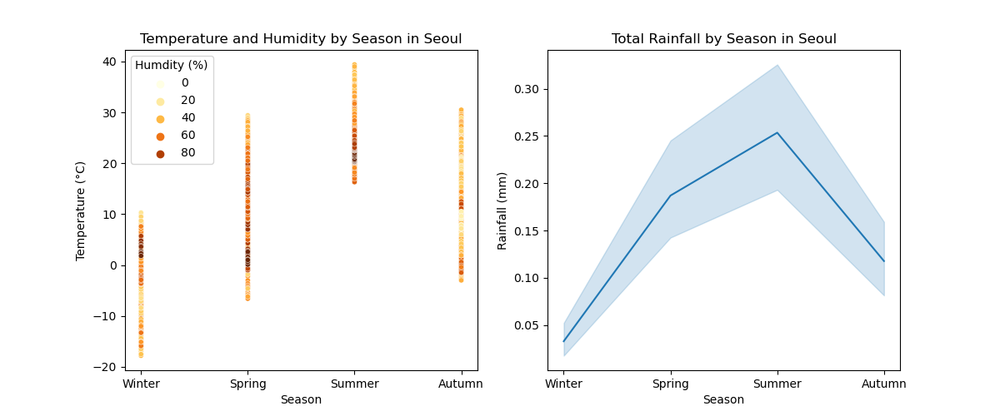

# Seoul Bike Sharing Demand Regression Analysis
***
**Author:** Rebecca Chu


## Overview

As the demand for an eco-conscious and affordable means of travelling within urban cities increases, the Seoul Metropolitan Government is looking to enhance their e-bike rental marketing strategy and introduce real-time targeting and personalised advertising to encourage e-bike usage. This multiple linear regression analysis aims to identify the conditions that influence the number of bikes rented per hour and provide recommendations for the optimal advertising periods. Using an iterative approach to model-building, the final model found that 8am on weekdays, and 6pm-10pm was associated with an increase in bikes rented. An increase in temperature and decrease in humidity was also associated with an increase in rentals. It is recommended that advertising targets commuters ahead of rush hours and that the campaign focuses on May, June and Autumn months.


## Business Problem

Seoul Public Bike, Ttareungyi, rental system was introduced to ease pressure on traffic congestion, air pollution and the rising oil prices in Seoul, while providing citizens with an opportunity for active mobility. Seoul Metropolitan Government is looking to enhance their e-bike rental marketing strategy by introducing real-time targeting and personalised advertising. To inform the development of their new campaign, they want to understand the factors that affect rental demand of public e-bikes. This analysis aims to identify the conditions during which bike rental numbers are at their highest and provide recommendations for optimal advertising periods.


## Data

The dataset being explored contains the number of public bicycles rented per hour in the Seoul Public Bike (Ttareungyi) rental system and can be found here https://archive.ics.uci.edu/dataset/560/seoul+bike+sharing+demand. It contains 8,760 hours of data for e-bikes rented from 01-12-2017 to 30-11-2018, including corresponding weather information and whether the day rented was a holiday. The target variable is the number of e-bikes rented per hour. 

Dawn and dusk data was calculated from the Astral package; more information can be found in the `dawn-dusk-times.ipynb` notebook.


## Methods

This projects follows the CRISP-DM methodology and utilises an iterative approach to building a multiple linear regression model. Any rows where the rental system was not functioning were removed from the dataset. Three variables were created to enhance analysis: month of rental, whether the hour was in daylight or not, and whether it was a weekday or weekend. 

The model was built for the purpose of statistical inference. To ensure that the variables that were identified as significant were not the result of overfitting to the training data, data was split into a 80/20 training and test dataframe. 


## Results

The final model yielded a r2 score of 0.736.

The following variables were identified as having the greatest association with number of bikes rented:

264.491900 * temp<br />
-106.846881 * humidity<br />
1051.757121 * hour_8<br />
1179.303151 * hour_18<br />
910.451510 * hour_19<br />
824.967505 * hour_20<br />
817.139707 * hour_21<br />
730.940509 * hour_22<br />
-537.465221 * rainfall_mm_1.0<br />
388.072778 * month_5<br />
516.898237 * month_6<br />
397.184192 * month_9<br />
471.429161 * month_10<br />
-49.390179 * day_of_week_weekend<br />
-841.632542 * hour_8*day_of_week_weekend


Rush hours (8am, and 6pm to 10pm) are associated with an increase in rental bikes as this is likely when commuters are heading into and out of work. The 8am increase in particular is seen only on weekdays; the number of bikes rented during this hour significantly drops on the weekend. Given that these hours see the highest coefficients across the entire formula, it may be assumed that a large share of bike users are commuting to work. We can also see that bike rentals tend to increase when it is not a holiday; this further supports the idea that users are riding for transport rather than pleasure or city sight-seeing.


Bike rentals tend to increase as the weather warms (as seen in the associated increase in temperature), however decreases when humdity increases. We can visualise this by looking at the monthly data - as we move out of Winter, bike rentals increase and peak at the start of Summer in June, dropping as we head into the hot, humid months of July and August. We then see a second, smaller peak in Autumn where it slowly declines into Winter.

Summer also experiences the most rainfall of the season; when transformed into a binary categorical, the model found that rain had a significant association with decreasing the number of bikes rented.


   
It should be noted that the data only measures the amount of rainfall within the hour, but does not take into consideration the rain's impact on the subsequent hours. For example, depending on the amount of rainfall in the previous hour, roads may be slicker, thus deterring potential riders. Further analysis should be done to assess the impact of rainfall on the hours following. 

While solar radiation and daylight is associated with an increase in bike rentals, they are not the strongest predictors.

The model performed similarly on the test data and I am confident that the variables selected would also be statistically significant beyond the training data, provided that there are no events that may drastically change trends.


## Conclusions

The regression analysis supported the following recommendations:

* Given that rush hours, i.e. Seoul working hours (9am to 6pm), were associated with the greatest increase in rented bikes, it may be assumed that the majority of riders are travelling to and from work. It is therefore recommended that personalised ads for commuters are released ahead of these hours to encourage a prompt call to action.
* Marketing campaigns should also focus on the warmer months, specially towards the end of Spring and the beginning of Summer, and again in Autumn.
* Avoid advertising on rainy days. The majority of annual preciptation falls during moonsoon/typhoon season from late June to the middle of September.


## Limitations and Next Steps

While public bike rental services in Seoul have existed since 2000, Seoul Bike was introduced in 2015, so the system was still relatively new when this data was recorded. Since 2015, Seoul Bike has increased the number of stations and bikes available to rent, naturally resulting in an increase in rentals. Growth in popularity and accessibility for tourists may have resulted in changes to trends. It would be recommended that further analysis is conducted on more recent data across a few years.

This analysis also does not take into consideration the different passes available in the rental system; additional exploration should be made to investigate the different behaviours amongst customer groups to inform a more personalised advertising approach. 


## Repository Structure
***

```
├── README.md                                      <- The top-level README for reviewers of this project
├── dawn-dusk-times.ipynb                          <- Narrative documentation of sourcing dawn and dusk times for Seoul in Jupyter notebook
├── seoul-bike-demand-regression-analysis.ipynb    <- Narrative documentation of analysis in Jupyter notebook
├── seoul-bike-demand-presentation.pdf             <- PDF version of project presentation
├── data                                           <- Sourced externally and generated from code
└── images                                         <- Generated from code
```